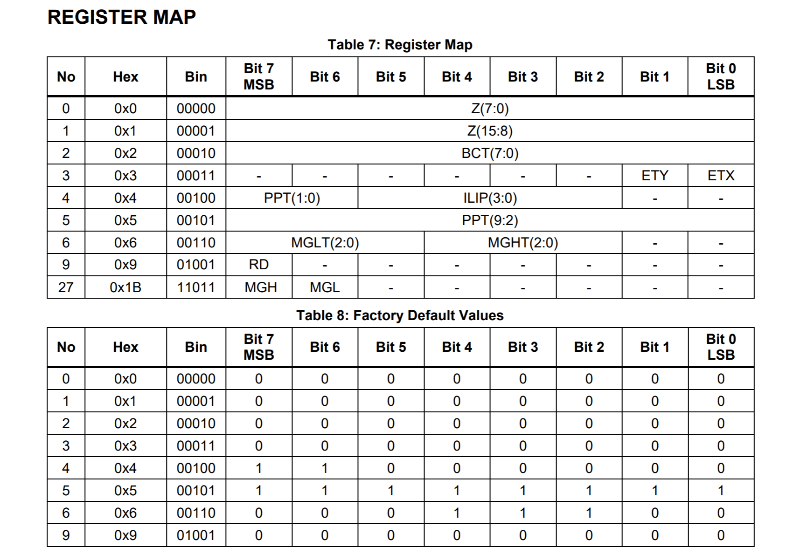
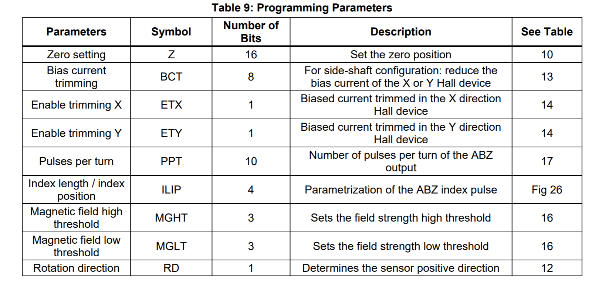
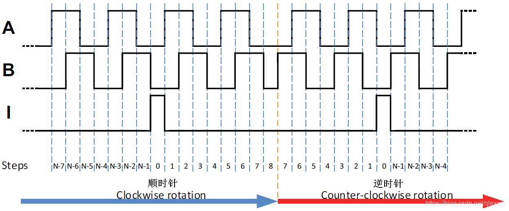
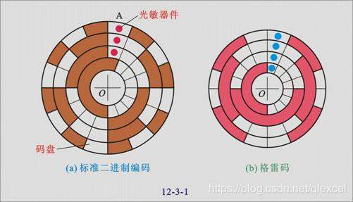

[toc]
####MA730
#####DESCRIPTION
1. 数据处理速度: 0~60000 RPM
2. 片上有非易失性存储可以用设置0角度为,ABZ编码器,磁场检测阈值

#####FEATURES
1. 14位绝对角度编码器
2. 使用SPI接口进行数据读出和芯片配置
3. 12位ABZ增量求积接口,每圈1-1024 可编程脉冲
4. PWM 14位输出
5. 可编程磁场检测强度
6. 电源:3.3V 500mA

#####GENERAL CHARACTERISTICS
- power-up time     max: 260 ms
- latency           max: 10 us
- accuracy          0.7 deg
- ABZ update rate   16 MHz
- resolution        4096

#####PIN FUNCITONS


#####BLOCK DIAGRAM


#####SPI
- SPI最大时钟频率   25MHz
- 所有发送给MA730的命令由MOSI pin传输, 且必须为16位
- 芯片1us传输一次角度到输出buffer, 主设备通过拉低CS引脚来触发读取,当检测到触发事件时,数据会保留在buffer中直到CS信号失效

- 如果传输的角度数据少于16bit,且主设备仍然发送了16次时钟脉冲,则低位补0;

- SPI读寄存器
  读取操作由两个16bit帧构成
  ```
  第一次:
    从设备->主设备:     angle(16bit)
    主设备->从设备:     010(3bit)reg.address(5bit).zero(8bit)  
  第二次:
    从设备->主设备:     response(8bit)zero(8bit)
    主设备->从设备:     zero(16bit)  
  ```
  

- SPI写寄存器

  1. 上图所示寄存器可写,数据保存在片上的非易失性存储中, 芯片上电时自动重新加载
  2. 片上存储可写1000次
  3. 写操作由两个16bit帧构成
  ```
  第一次:
    从设备->主设备:     angle(16bit)
    主设备->从设备:     100(3bit)reg.address(5bit)reg.value(8bit)
  第二次:
    从设备->主设备:     readbackreg.value(8bit)zero(8bit)
    主设备->从设备:     zero(16bit)
  ```
  4. 第一帧和第二帧之间必须要25ms的间隔(读角度和读寄存器不需要此时间间隔)

    
    
#####REGISTER SETTINGS
- zero settings
   ma730 输出的角度a<sub>out</sub>
   &ensp;&ensp;&ensp;&ensp;a<sub>out</sub> = a<sub>raw</sub> - a<sub>0</sub>
   a<sub>raw</sub>由MA前端提供的未经处理的角度
   a<sub>0</sub> = 2<sup>16</sup> - Z(15:0)
   
- rotation direction
  默认情况下, 从上方观察, 磁场顺时针旋转时角度增加
  配置RD寄存器可以修改


#####tips
1. 编码器的分类
   根据检测原理,编码器可分为光学式、磁式、感应式和电容式,根据其刻度方法及信号输出形式,可分为增量式、绝对式以及混合式三种.
2. 增量式编码器
   增量式编码器是直接利用光电转换原理输出三组方波脉冲A、B和Z相,A、B两组脉冲相位差90,从而可方便的判断出旋转方向,而Z相为每转一个脉冲,用于基准点定位.
   它的优点是原理构造简单,机械平均寿命可在几万小时以上,抗干扰能力强,可靠性高,适合于长距离传输.
   其缺点是无法输出轴转动的绝对位置信息.
   
   编码器输出三组方波脉冲A、B和I相.
   A、B两组脉冲相位差90度,根据谁先出现可以方便的判断旋转方向.而Z相为每转一圈输出一个脉冲,用于基准点定位.
3. 绝对式编码器
   绝对式编码器是直接输出数字的传感器.
   在它的圆形码盘上沿径向有若干同心码盘,每条道上有透光和不透光的扇形区相间组成,相邻码道的扇区数目是双倍关系,码盘上的码道数是它的二进制数码的位数.
   在码盘的一侧是光源,另一侧对应每一码道有一光敏元件,当码盘处于不同位置时,各光敏元件根据受光照与否转换出相应的电平信号,形成二进制数.
   这种编码器的特点是不要计数器,在转轴的任意位置都可读书一个固定的与位置相对应的数字码.
   显然,码道数越多精度越大.目前国内已有16位的绝对编码器产品.
   
4. 磁编码器原理
  磁性旋转编码器依赖于三个主要组件: 磁盘,传感器和调节电路.
  磁盘已磁化,其圆周上有许多磁极.传感器检测磁盘旋转时磁场的变化,并将此信息转换为正弦波.
  传感器可以是感应电压变化的霍尔效应器件,也可以是感应磁场变化的磁阻器件.
  调节电路对信号进行倍增,分频或内插以产生所需的输出.

5. SPI总线介绍
   
   
   CPOL: IDLE时CLK的极性, 0 -- 低电平, 1 -- 高电平
   CPHA: 数据有效时的相位, 0 -- 第一个边沿, 1 -- 第二个边沿
   
   