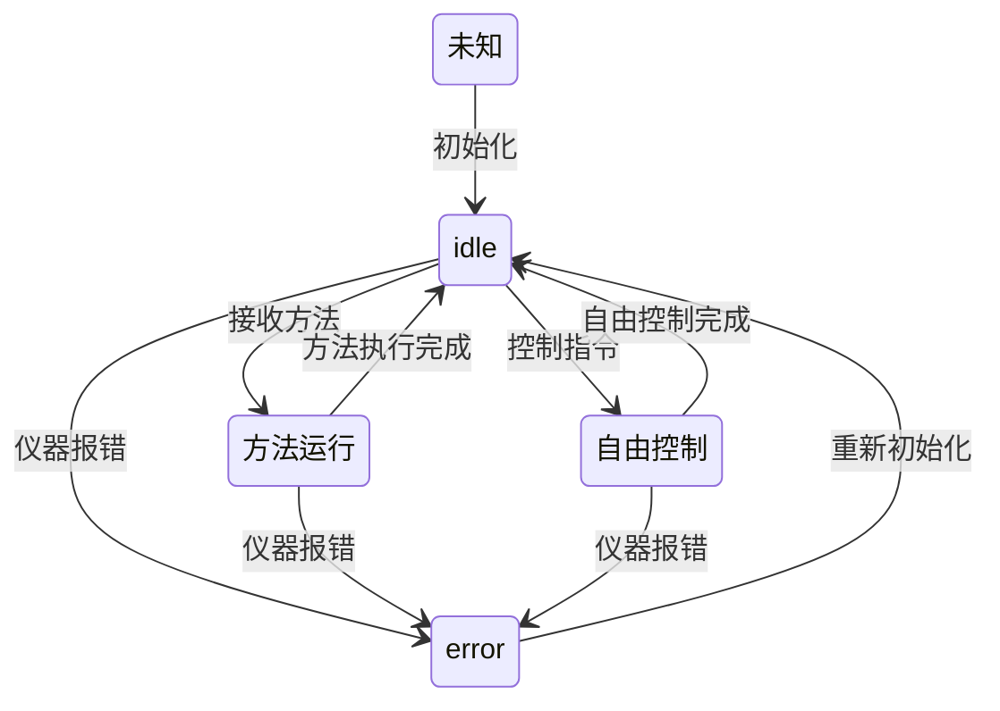

#####当前泵的问题
1. 泵参数配置较多不利于维护
2. 状态机混乱

#####状态
- 未知状态
  此状态是仪器通电尚未初始化时的状态
- idle状态
  将idle状态定义为**允许接收方法并运行**的状态, 此状态可以是泵流速为0, 也可以是泵灌注之后
- 自由控制状态
  在**idle状态**或**方法运行状态**下进行任何控制都会进入到自由控制状态.  自由控制状态下有以下3中模式:

    动态  |  静态
    ---- | ---- 
    灌注  | 停泵
    供液 | 

- 方法运行状态
  只能从**idle状态**进入. **idle状态**下接收到方法即进入此状态.
- 错误状态
  任何情况下仪器报错进入此状态

