#### Qt编译问题
1. **ASSERT: "!"No style available without QApplication!**
- 解决方法
  .pro文件添加 QT += charts qml quick
  将 QGuiApplication app(argc, argv); 修改为QApplication app(argc, argv); **记得修改头文件引用**
- 原因
  QApplication 继承自QGuiApplication ,对于有继承基本Qt widgets的 需要用QApplication,而ChartView来自于Qt widgets

2. Q_INVOKABLE 定义的函数必须有参数

3. 如果在其他编辑器中新增了文件, 编译出错可能是没有加入到编译工程中


#### QML/Qt
- qml控制小数点位数 toFixed()

  eg: 两位小数使用 toFixed(2)
  ```
            TextField {
                id: id_cfg_value
                width: 200
                text: model.value.toFixed(2)
                font.pointSize: 12
                onTextEdited: {
                    model.value = parseFloat(id_cfg_value.text)
                }
            }
  ```

- 报qt_metacast 之类的错
  - 多继承只需要一个Q_OBJECT宏
  - 也可能是没有把文件加入到工程中

- 如何实现动态曲线
  - 定义一个变量来保存时间, x轴的min/max值根据这个变量生成
    ```
      property int timer: 0
    ```

    ```
    ValueAxis{
        id: id_axis_x
        min: timer - 5000
        max: timer + 500
        tickCount: 100
        tickInterval: 1000
    }
    ```
    ```
    Timer{
        id: id_timer
        interval: 50
        repeat: true
        running: true
        onTriggered: {
            timer += 500
            draw_curve(timer, Math.random())
        }
    }
    ```
    **qml绘图cpu占用极高, 待解决**

 
- QML 读写文件

  QML没有提供文件读写的接口, 需要使用C++来实现
  ```
  #ifndef FILE_OBJECT_H
  #define FILE_OBJECT_H
  #include <QObject>

  class FileObject : public QObject
  {
      Q_OBJECT
      Q_PROPERTY(QString source READ source WRITE setSource NOTIFY sourceChanged)
  public:
      explicit FileObject() {};
      ~FileObject() {};

      Q_INVOKABLE QString read();
      Q_INVOKABLE bool write(const QString& data);
      
    Q_INVOKABLE void setSource(const QString& source) { m_source = source; };
      QString source() { return m_source; }
      
  signals:
      void sourceChanged(const QString& source);

  private:
      QString m_source;
  };

  #endif // FILE_OBJECT_H
  ```

  ```
  #include "FileObject.h"

  #include <QFile>
  #include <QTextStream>

  /*
  FileObject::FileObject(QObject *parent) :
      QObject(parent)
  {

  }
  */

  QString FileObject::read()
  {
    QString content;
      QFile file(m_source);
      if ( file.open(QIODevice::ReadOnly) ) {
        content = file.readAll();
          file.close();
      } 
      
      return content;
  }

  bool FileObject::write(const QString& data)
  {
      QFile file(m_source);
      if ( file.open(QFile::WriteOnly | QFile::Truncate) ) {
          QTextStream out(&file);
        out<<data;
        file.close();
        return true;
      }
      else {
        return false;
      }
  }
  ```

  在 main.cpp 注册这个文件读写类
  ```
  qmlRegisterType<FileObject>("Coruitech.device",1,0,"FileObject")
  ```

  QML中导入并使用
  ```
  import Coruitech.device 1.0

  FileObject{
      id: fileObject
  }
  fileObject.setSource(id_folderlistmode.get(comboBox.currentIndex,"filePath"))
  var text = fileObject.read()
  ```  

- 文件路径的截取
  1. 使用```FileDialog```获取到的路径是类似```file:///xxxxx```, 需要将```file:///```截掉
  2. 使用QStirng的函数section来完成, section可以使用正则表达式
      ``` QString file_path = localPath.section(QRegExp("///"), 1);```
      表示截取```///```后面的部分

- Qt5中没有QFtp的解决方法(下载qftp代码编译动态库并部署)
  1. 下载QFtp源代码(https://github.com/qt/qtftp)
  2. 编译
  点击修改pro文件
  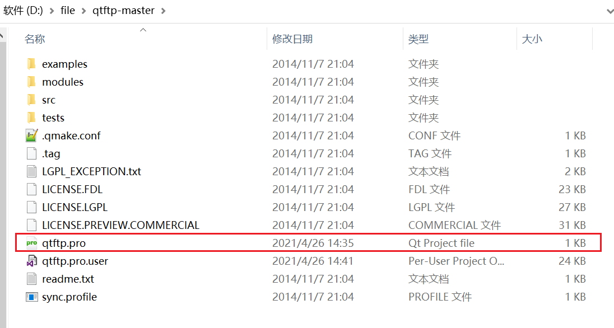
  只保留src文件夹的编译即可
  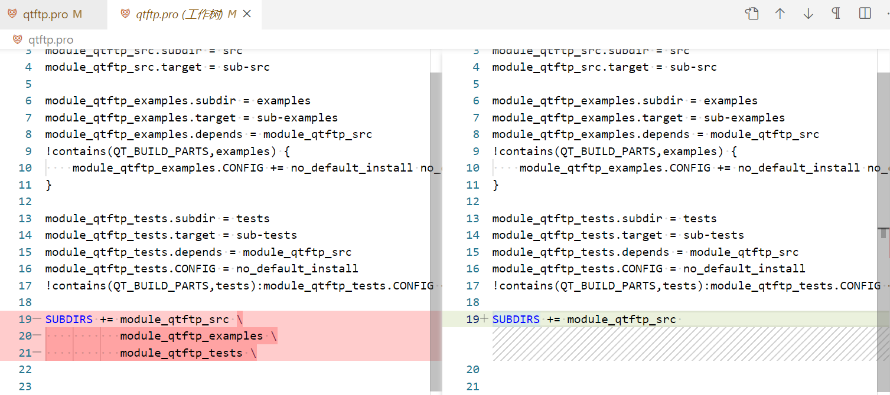
  修改编译选项```qtftp\src\qftp\ftp.pro```
  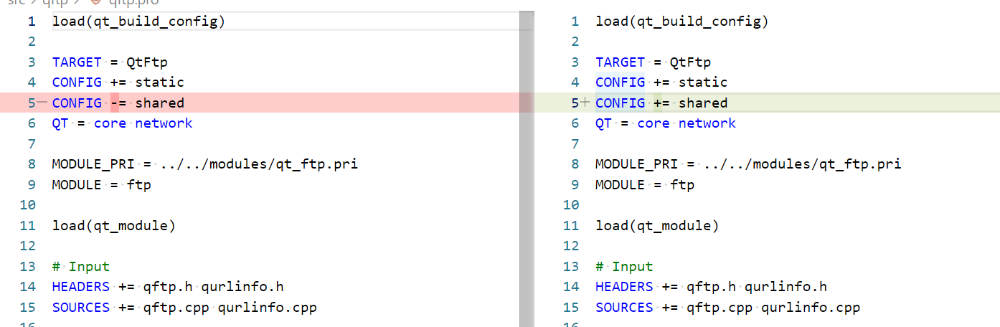
  修改文件```src/qftp/qftp.h```
  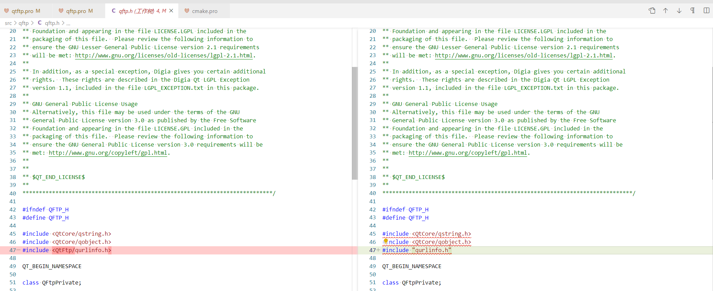
  编译完成后会在目录下生成动态库静态库文件
  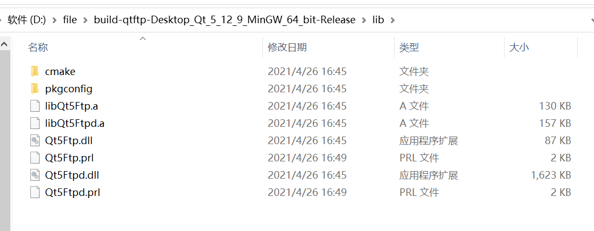
  3. 部署
      1. 将动态库(.dll文件)拷贝至qt的bin文件夹下
      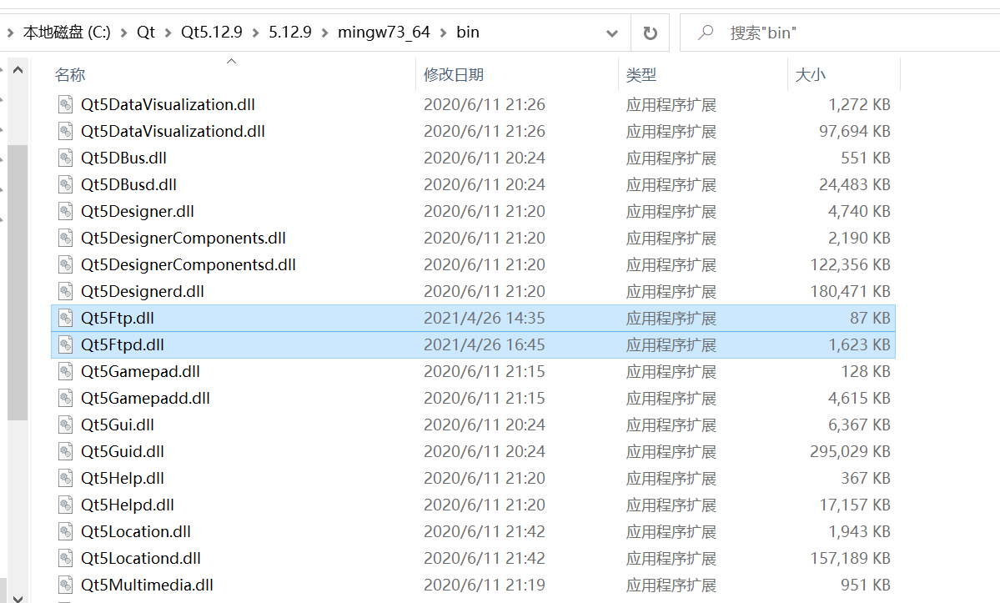
      2. 将静态库(.a文件)及.prl文件拷贝至qt的lib文件夹下
      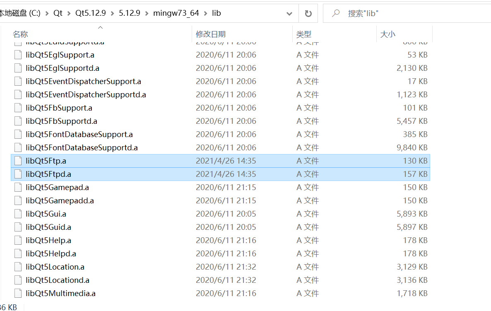
      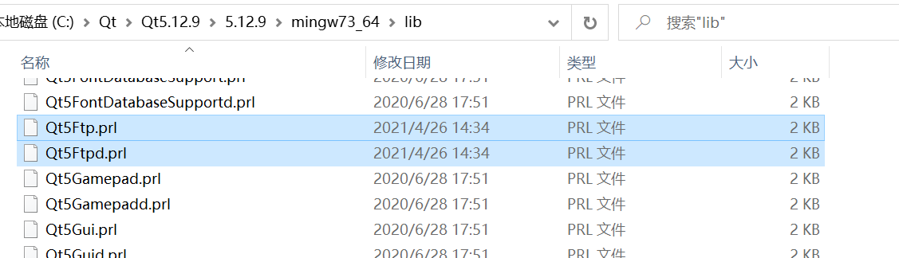
      3. 将构建目录下/include/目录下的 QtFtp文件夹拷贝至Qt的include目录下,将```src/qftp/```下的两个头文件拷贝至此
      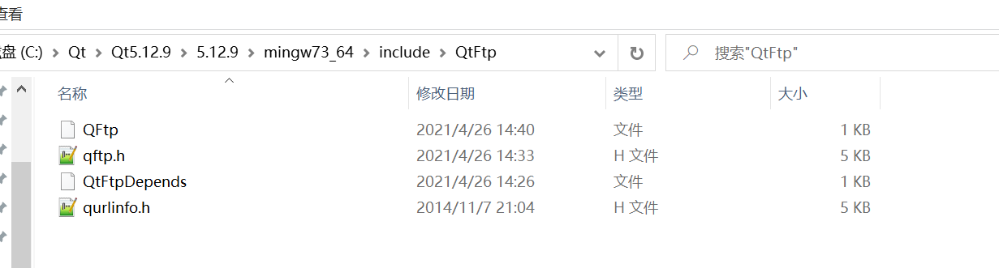
      4. 在该目录下创建一个文件```QFtp```注意**没有扩展名**, 并在其中写上```#include"qftp.h"```
      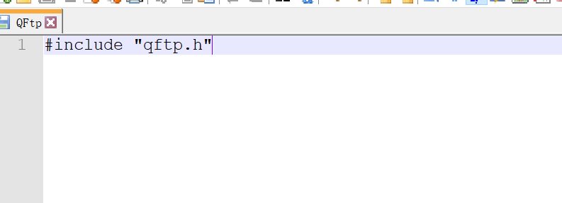
      5. 将构建目录下文件 ```\mkspecs\modules-inst\qt_lib_ftp.pri```拷贝至 Qt 目录下的```mkspecs\modules```
      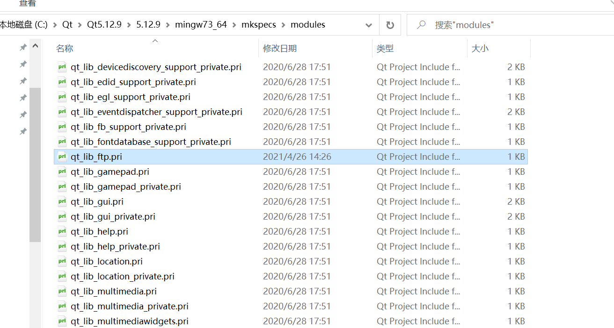
      6. 在项目的 .pro文件添加```QT    +=   ftp```
      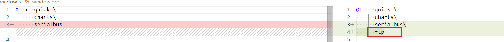
    4. **注意**
        1. QFtp 上传文件时```dataTransferProgress```信号似乎不能准确反映上传进度, 总是一开始就返回已全部传输完成. 如果使用```put(QIODevice * dev, const QString & file, TransferType type = Binary)```接口不会出现这样的情况

- Qt中延时
  ```
  void QSleepTimeSet::Delay_MSec(unsigned int msec)
  {
    QTime _Timer = QTime::currentTime().addMSecs(msec);
    while( QTime::currentTime() < _Timer )
    {
      QCoreApplication::processEvents(QEventLoop::AllEvents, 100);
    }
  }
  ```

- C++ 的lambda表达式
  lambda 表达式定义了一个匿名函数,并且可以捕获一定范围内的变量,lambda 表达式的语法形式可简单归纳如下:
  ```[ capture ] ( params ) opt -> ret { body; };```
  capture 是捕获列表,params 是参数表,opt 是函数选项,ret 是返回值类型,body是函数体

  在lambda表达式中, 捕获的参数默认是不可变的, 编译时会报错
    ```Cannot assign to a variable captured by copy in a non-mutable lambda```
    eg:
    ```
    connect(reply, &QModbusReply::finished, this,[this,state,reply]()
    {
      .
      .
      .
    });
    ```
  使用关键字```mutable```,将参数改为可变的
  eg:
  ```
  connect(reply, &QModbusReply::finished, this,[this,state,reply]() mutable
  {
    .
    .
    .
  });
  ```
